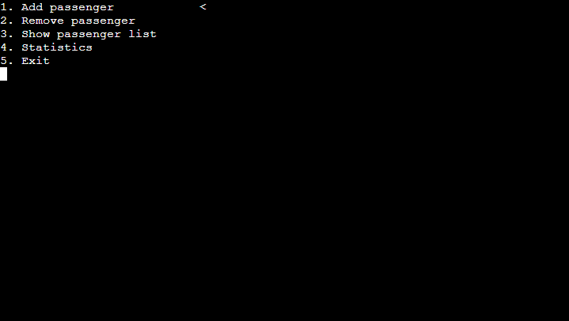
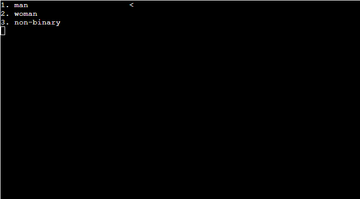
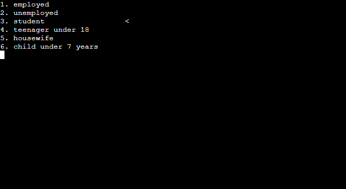
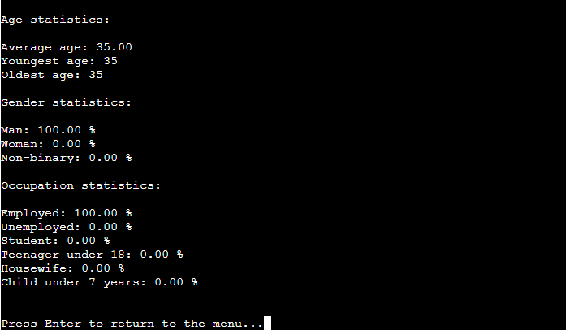

#  Buss Simulator: bus passenger management system

## Introduction
The **Buss Simulator** is a Python-based program that allows users to manage a list of bus passengers and runs in the Code Institute mock terminal on heroku. It provides functionalities to add, remove, view passengers, and display statistical data such as age, gender, and occupation distributions. This project is a demonstration of object-oriented programming (OOP) principles and interactive console-based user interfaces.

### [Here is a live version of Buss simulator](https://buss-simulator-finale-aeb3a20d9187.herokuapp.com/)

---

## How Does It Work
The **Bus Passenger Management System** is designed to be run in a Python-supported environment, providing users with an intuitive and interactive console interface. Once the program is launched, the user is presented with a menu-driven system that allows easy navigation using arrow keys and selection using the `Enter` key. Users can add new passengers by inputting their age, selecting their gender, and choosing their occupation from predefined lists. The system validates these inputs to ensure correctness. Passengers can be removed by selecting them from a displayed list, and the program will provide a confirmation of the removed individual. At any point, users can view the full list of passengers with detailed information or analyze statistical data such as average age, gender distribution, and occupation breakdowns. The program runs in a loop until the user explicitly chooses to exit, ensuring seamless interaction throughout its use.

1. **Run the Program:** Execute the script in a Python environment with the required dependencies installed.
2. **Interactive Menu:** Use arrow keys to navigate through the options and the `Enter` key to select:
   - Add a new passenger
   - Remove an existing passenger
   - View the current list of passengers
   - Display passenger statistics
   - Exit the program
3. **Follow Prompts:** For certain actions like adding or removing passengers, follow on-screen instructions.

---

## Features
- **Interactive Console Interface:** Uses arrow keys for navigation and inputs for selecting options.


- **Passenger Management:**
  - Add passengers with details such as age, gender, and occupation.

  

  
  
  
  - Remove passengers by selecting from the list.

  
  - View a detailed list of all passengers.

  


- **Statistics:**
  - Calculate and display average, minimum, and maximum age of passengers.
  - Display gender distribution as percentages.
  - Display occupation distribution as percentages.

  
- **Data Validation:**
  - Ensures valid inputs for age, gender, and occupation.
  - Handles invalid inputs gracefully with error messages.

  
  

---

## Data Model
### Passenger Class
A `Passenger` represents an individual passenger with:
- **Age** (`int`): Age of the passenger (1-200).
- **Gender** (`str`): Gender of the passenger (`man`, `woman`, `non-binary`).
- **Occupation** (`str`): Occupation of the passenger from a predefined list.

### Bus Class
The `Bus` class manages a list of `Passenger` objects and provides methods for:
- Adding passengers
- Removing passengers
- Viewing passengers
- Calculating and displaying statistics

---

## Testing
### Manual Testing
1. **Adding Passengers:** Test by adding passengers with various valid and invalid inputs to ensure proper validation and storage.
2. **Removing Passengers:** Verify removal works correctly and handles edge cases like empty lists or invalid indexes.
3. **Statistics Display:** Add a variety of passengers and ensure that all statistics (age, gender, and occupation) are calculated correctly.
4. **Navigation:** Test the menu navigation for proper functionality.

### Automated Testing
Automated testing can be implemented using Python’s `unittest` framework to test individual methods like:
- `add_passenger`
- `remove_passenger`
- `calculate_age_statistics`
- `calculate_gender_percentage`
- `calculate_occupation_percentage`

---

## Bugs
- **Edge Case Handling:** The system might not handle large-scale inputs efficiently if a very high number of passengers are added.
- **Input Formatting:** Inputs are limited to predefined formats, which might not accommodate non-standard genders or occupations.

---

## Validator Testing
The code adheres to Python best practices and is validated using:
1. **PEP8 Compliance:** Ensured code formatting using tools like `flake8`.
2. **Dependencies Validation:** Verified the correct installation of `replit` and `getkey` modules.
3. **Input Validation:** All user inputs are checked for correctness before processing.

---

## Deployment
1. **Environment Setup:**
   - Ensure Python 3.x is installed.
   - Install required dependencies using:
     ```bash
     pip install replit getkey
     ```
2. **Run the Program:** Execute the `main.py` script using:
   ```bash
   python main.py

3. **Deploy to heroku:** 
  - This project was deployed using mock terminal in Heroku.
    - Create a new heroku app after creating a free heroku account.
    - Set the building blocks to `Python` and `node.JS` in this order.
    - link the heroku app to the repository
    - click **Deploy**

